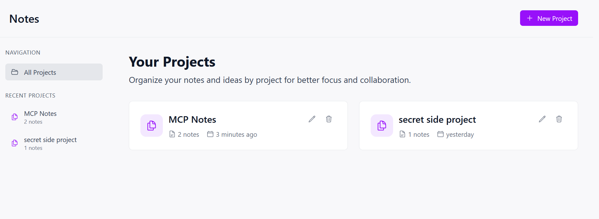
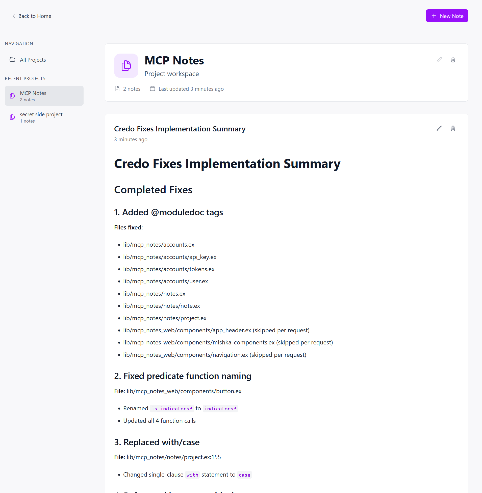

# MCP Notes

It's an MCP notes for your notes and plans that coding agents generate.

It's 99.9% vibe-coded.

## Exposed commands

-list_projects

-list_notes

-list_notes_for_project

-add_project

-add_note_to_project

-update_note

-delete_project

-delete_notes_for_project

-stats

## Usage example

```
> run `mix credo`, create a plan to fix reported issues, and save them in MCP for the current project 
```





## How to run:

### Release

- Grab a [release]. These are compiled for Ubuntu
- `DATABASE_PATH=<path to your sqlite database, file will be created> bin/mcp_notes start`

### From source

```
> git clone https://github.com/dmitriid/mcp_notes.git
> cd mcp_notes.git
> iex -S mix phx.server
```

or

```
> git clone https://github.com/dmitriid/mcp_notes.git
> cd mcp_notes.git
> mix deps.get && MIX_ENV=prod mix release
> DATABASE_PATH=<path to your sqlite database, file will be created> _build/prod/rel/mcp_notes/bin/mcp_notes start
```
